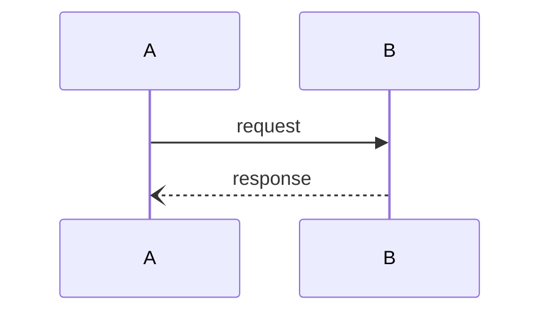

# Mermaid Preview

Add Mermaid diagrams to VS Code Markdown Preview

## Usage

````

```mermaid
graph TD;
  A-->B
  A-->C
  B-->D
  C-->D
```
````

````

```mermaid
sequenceDiagram
  participant A
  participant B
  A->>B: request
  B--)A: response
```
````

