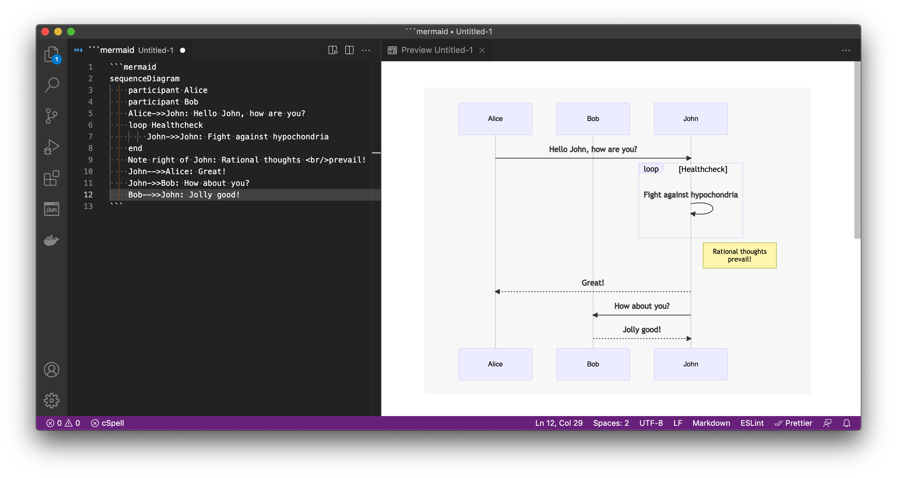
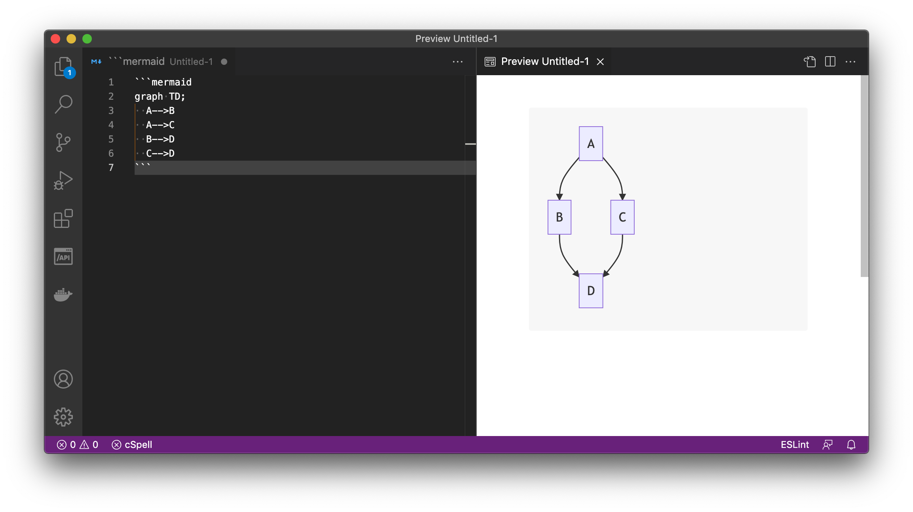
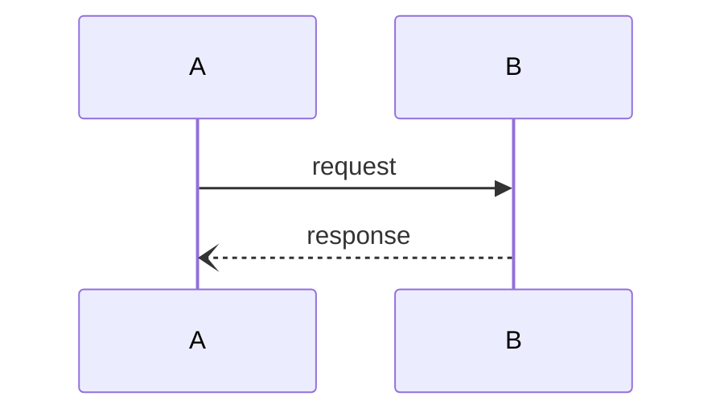
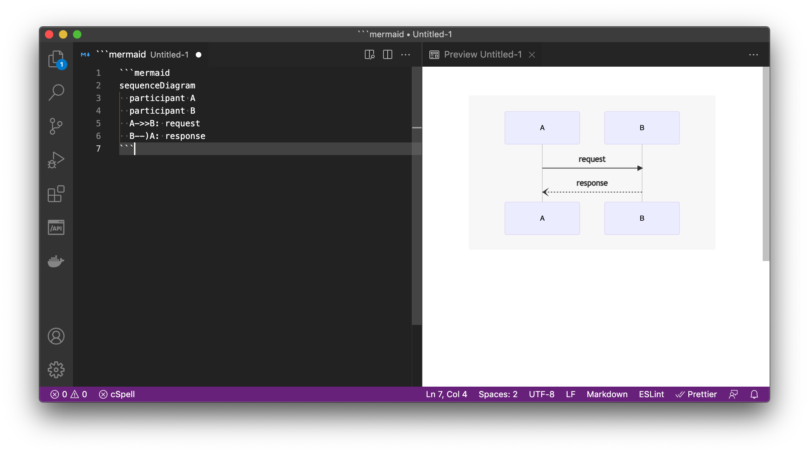
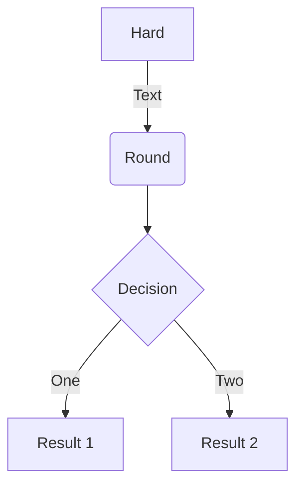
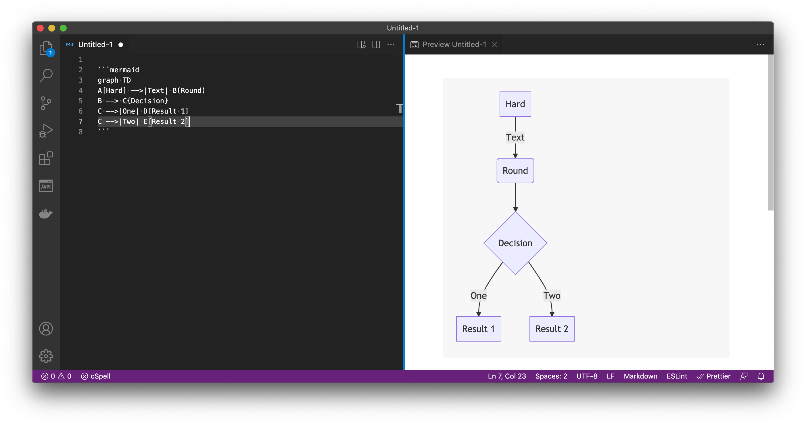

# Mermaid Preview

Add Mermaid diagrams to VS Code Markdown Preview



## Usage

````

````



````

````



````

````




## Settings

| Name                 | Default   | Description          |
| -------------------- | --------- | -------------------- |
| mermaidPreview.theme | `default` | The Mermaid-JS theme |
